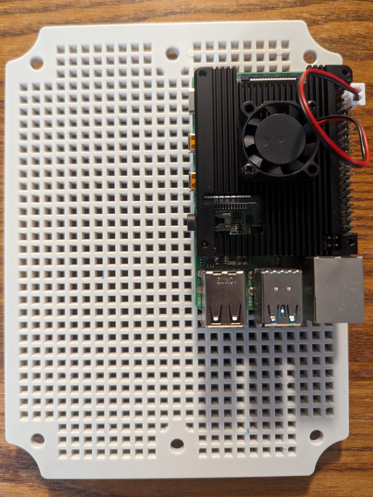
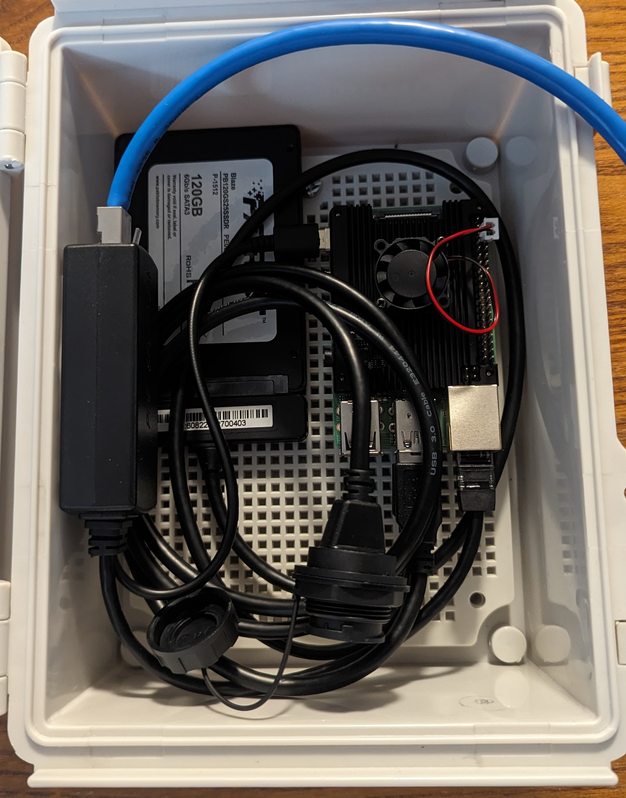
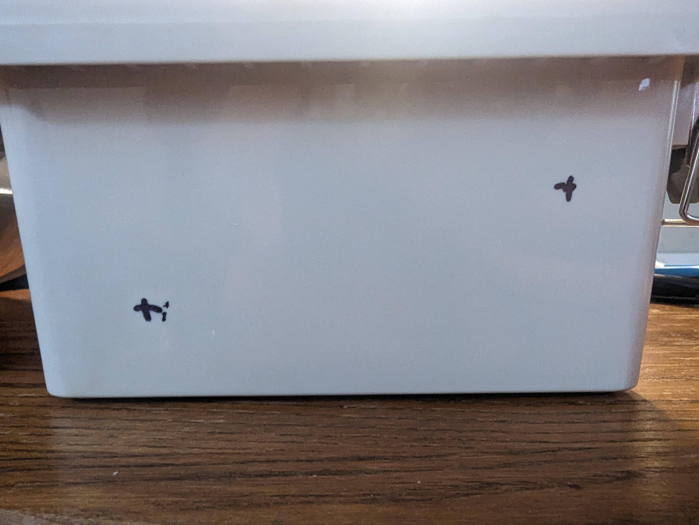
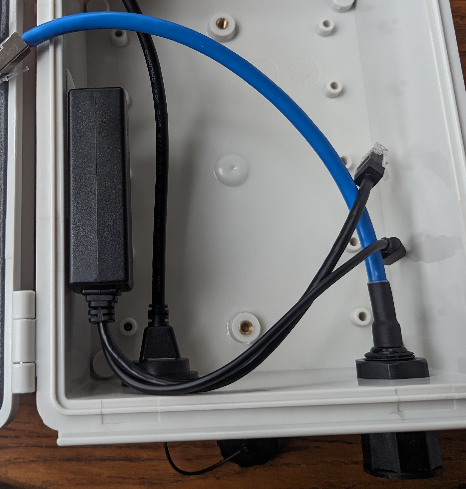
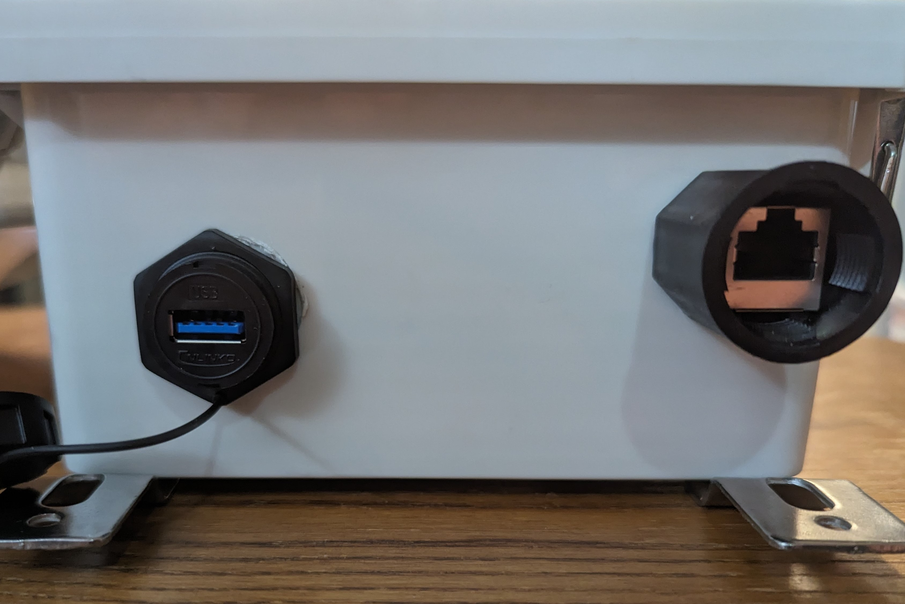
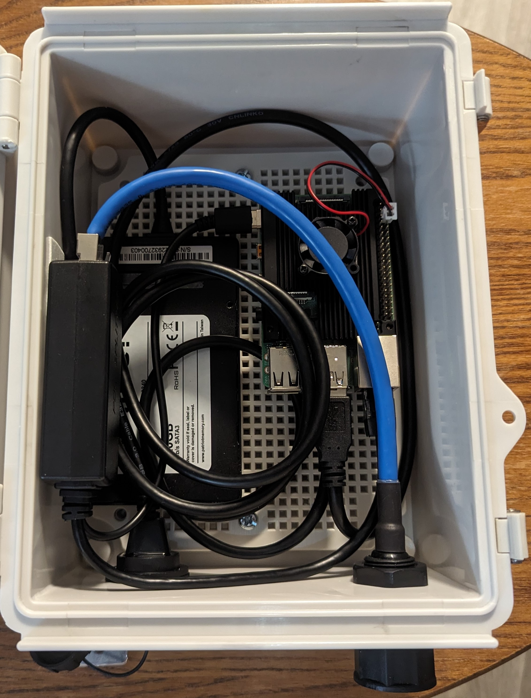

# BirdBox: BirdNET Pi Real-Time Acoustic Bird ID Station Guide

## Introduction
Welcome to the BirdBox project! This guide is designed to assist you in building a real-time acoustic bird identification station using BirdNET Pi and a Raspberry Pi.

## Materials Required
The following materials are suggested for the BirdBox project:

- **Raspberry Pi (4B/3B+/0W2):** [Approved Pi Resellers](https://www.raspberrypi.com/resellers/?q=)
- **Waterproof Project Box:** [Example](https://www.amazon.com/dp/B085QCT543)
- **MicroSD Card** (Not required if booting from SSD): [Example](https://www.amazon.com/dp/B09W9XYQCQ)
- **SSD** (Optional, for additional storage or as primary boot drive): [Example](https://www.amazon.com/dp/B01N5IB20Q)
- **SATA to USB cable** (Only required if using SSD): [Example](https://amazon.com/dp/B011M8YACM)
- **Heatsink with Fan:** [Example](https://www.amazon.com/dp/B07Z3Q417K)
- **Waterproof/Outdoor Ethernet Connector:** [Example](https://www.amazon.com/dp/B07PH4GL2F)
- **Waterproof/Outdoor USB 3.0 Cable:** [Example](https://www.amazon.com/dp/B079957VC3)
- **USB Microphone:** [Example](https://www.amazon.com/dp/B06XCKGLTP)
- **PoE to USB-C Adapter:** [Example](https://www.amazon.com/dp/B087F4QCTR)

Other hardware configurations exist but supporting them is currently beyond the scope of this guide.
I suggest checking the [BirdNET-Pi repo](https://github.com/mcguirepr89/BirdNET-Pi) for information related to other configurations.

## Setup Steps
1. Install a compatible OS on the boot drive. If using an SSD or other USB boot device, documentation on enabling Raspberry Pi USB boot can be found [here](https://www.raspberrypi.com/documentation/computers/raspberry-pi.html#usb-mass-storage-boot).
	I recommend following [the official "Getting Started" guide](https://www.raspberrypi.com/documentation/computers/getting-started.html) from raspberrypi.com to install and configure the OS.
	  *	**IMPORTANT NOTE:** "Raspberry Pi OS (Legacy, 64-bit) Lite" currently must be selected during imaging due to [Issue #1055](https://github.com/mcguirepr89/BirdNET-Pi/issues/1055). 
	  *	This image uses Debian 11 (bullseye), so other bullseye-based images may also be compatible. 
2. Install fans/heatsinks on the Raspberry Pi if using them.
3. Mount the Raspberry Pi onto the backplate of the box.  
	  *	I found that the screws included with the standoffs for the heatsink fit neatly through the holes of the backplate when using a screwdriver or drill.
		
4. Attach SSD to the backplate alongside Pi if using one.
5. Connect SSD to the Pi using SATA to USB adapter.
6. Plan your layout with all internal hardware and cables, marking positions where needed.
	  *	Make sure to also mark positions for the external Ethernet and USB adapters now.
		
		
7. Remove all hardware from the box.
8. Install the four included mounting braces on the back of the box.
9. Drill or cut the holes for the USB and Ethernet adapters.
	  *	Using a Forstner bit set for my hand drill I was easily able to cut appropriately sized holes.
10. Install the external USB and Ethernet adapters, managing cables as needed.
		
		
11. Install backplate into the box using provided screws.
12. Attach POE adaptor to side of box using double-sided tape or hook and loop tape.
13. Connect external ethernet adapter to the POE adapter.
14. Connect the PoE adapter's Ethernet and USB-C cables to the Raspberry Pi.
15. Connect the external USB adapter's cable to the Pi.
		
16. Close and mount box somewhere you want to record birdsong and have access to POE.
17. Connect POE Ethernet to external port and wait for device to become available over SSH.
18. Connect to the Pi using SSH credentials set during imaging
19. Install BirdNET-Pi software on the micro SD card. Official installation guide [here](https://github.com/mcguirepr89/BirdNET-Pi/wiki/Installation-Guide).

	**WARNING: I do not host the code below. Always verify external code before executing it.**

	```bash
	curl -s https://raw.githubusercontent.com/mcguirepr89/BirdNET-Pi/main/newinstaller.sh | bash
 	```

## Configuration Steps
- Web UI
  	*	Open either "${hostname}.local" or the IP address for your Pi in a browser within the same LAN.
	*	Navigate to Tools >> Settings in the BirdNET-Pi UI.
	  	*	**Model:** Strongly recommend "BirdNET_GLOBAL_6K_V2.4_Model_FP16" unless your device is unable to handle it.
    		*	**Location and BirdWeather:** Set these parameters if you intend to share data publicly with BirdWeather.
      		*	**Notifications:** Use Apprise to send detection notifications and/or weekly reports.
		*	**Bird Photos from Flickr:** Necessary for photos to be associated with detections in the web UI and in push notifications.
    				Instructions for acquiring a Flickr API key can be found [here](https://www.flickr.com/services/api/misc.api_keys.html)
   		*	**Localization/Time and Date**: Ensure these sections are correct.
     		*	Before leaving this page, make sure to click "Update Settings" at the bottom of the page to save your changes.
     	*	Click "Advanced Settings" at the bottom of the page.
      		*	**Privacy Threshold:** Start with 1% and move up as needed.
		*	**Full Disk Behavior:** Make sure that "keep" is selected if you don't want data to be deleted when disk is full.
		*	**Audio Settings:** Feel free to tweak recording length especially for performance reasons.
		*	**BirdNET-Pi Password:** Very important whether you decide to expose your installation to the internet or not.
		*	**Custom URL:** Used if you decide to expose your installation under a domain name.
		*	**Options/Custom Image:** Small tweaks.
		*	**BirdNET-Lite Settings:** Important for setting confidence values for detections. 
  
- DNS/hostname/Caddy
- External access
  
  	A guide on this subject can be found in the BirdNET-Pi repo [here](https://github.com/mcguirepr89/BirdNET-Pi/discussions/161).

## Usage
This outdoor system records and analyzes bird sounds for species identification. 
It also supports live streaming, push notifications, and BirdWeather integration. 

Refer to the installation guide for details on joining the BirdWeather network.

## Credits
This project was inspired by [PixCams](https://pixcams.com/building-a-birdnet-pi-real-time-acoustic-bird-id-station/). 
Thank you to the wonderful people at [Cornell Labs](https://birdnet.cornell.edu/) for making BirdNET publicly available.
Consider supporting BirdWeather by purchasing their official BirdWeather PUC [here](https://www.birdweather.com/).


